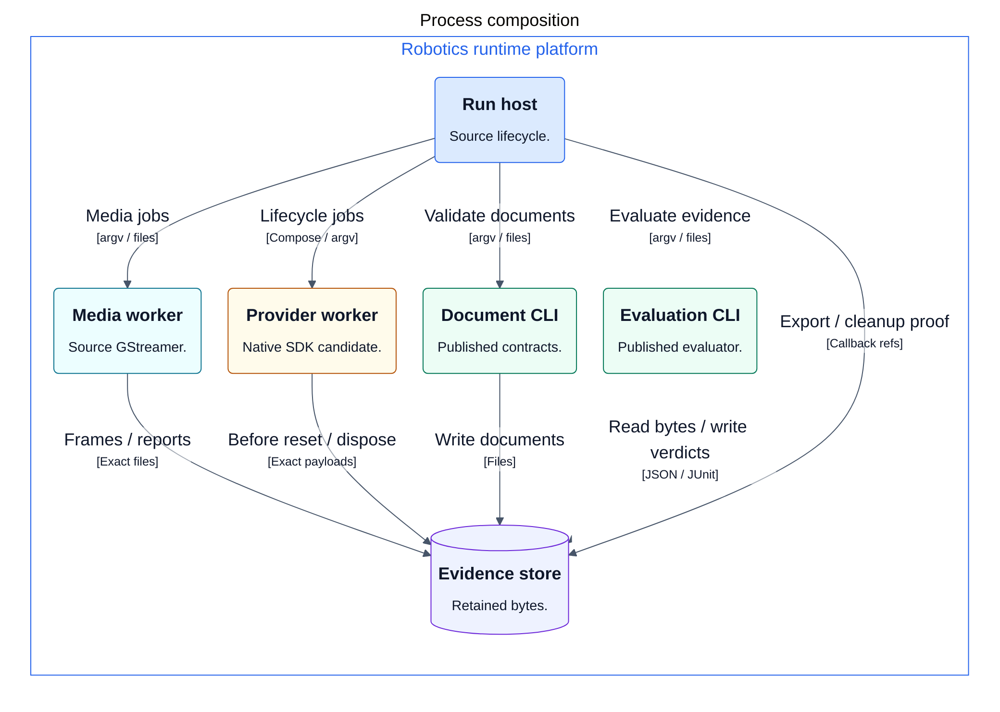
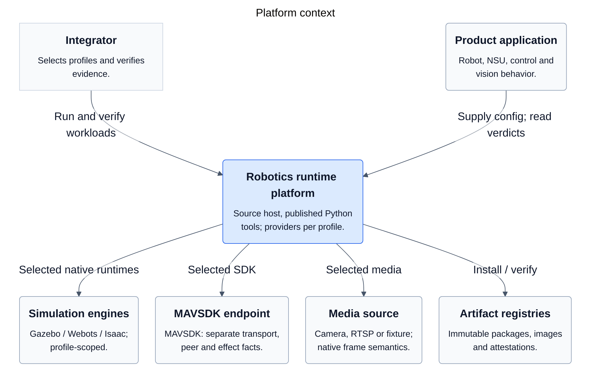

# Robotics runtime

Contracts and evidence tools for composing and qualifying robotic software.

The workspace contains two independently versioned Python packages:

- **robotics-runtime-contracts** validates execution, evidence and qualification
  documents, and writes artifacts without changing signed bytes.
- **robotics-acceptance-harness** observes an existing execution and evaluates
  retained evidence. It does not launch services or control a robot.

[robotics-runtime-infra](https://github.com/mmkolpakov/robotics-runtime-infra)
owns worker images, simulator providers, product provisioning, deployment and
execution qualification. Product repositories own robot models, scenes, control
logic and vision models. Home machine administration is a separate project and
supplies target prerequisites.

## Start with the part you need

Use contracts to validate files independently of ROS or a simulator. Use the
harness to evaluate evidence for a supported qualification profile. Use infra
to launch a composition and record what actually ran.

The published pair is
[contracts 0.18.3](https://pypi.org/project/robotics-runtime-contracts/0.18.3/) and
[harness 0.19.2](https://pypi.org/project/robotics-acceptance-harness/0.19.2/):

```bash
python -m pip install robotics-runtime-contracts==0.18.3 robotics-acceptance-harness==0.19.2
robotics-contracts --help
robotics-acceptance --help
```

Package reference:
[contracts](packages/contracts/README.md),
[harness](packages/harness/README.md),
[consumer examples](packages/contracts/consumer-examples/README.md).

Harness requires contracts `>=0.18,<0.19`; release checks install the exact
published pair outside the workspace. Package installation does not qualify
a simulator, image, accelerator or physical target.

## Architecture

These C4 views cover the joint platform in both repositories. The Python pair
is published separately; the composition host and candidate providers require
their own release qualification.

### Process composition

<!-- architecture:Container:start -->



<!-- architecture:Container:end -->

Colors distinguish roles: composition, published Python tools, native candidates,
media and retained files. They are not qualification verdicts. Control and video
use their native connections; lifecycle completion and evidence evaluation are
separate outcomes.

<details>
<summary>C4 context — product boundaries and external systems</summary>

<!-- architecture:Context:start -->



<!-- architecture:Context:end -->

</details>

[Native interfaces](docs/architecture/generated/NativeInterfaces.svg) and
[consumer interfaces](docs/architecture/generated/ConsumerInterfaces.svg)
separate SDK/media paths from document and evaluation dependencies.
The [complete graph](docs/architecture/generated/ContainerDetail.svg) remains
available as a reference.

[Diagram sources, sequence and deployment](docs/architecture/README.md).

The selected host uses upstream [Cordis](https://github.com/cordiverse/cordis)
for local plugin loading, service bindings and managed effects. Cluster scheduling
belongs to the deployment backend.
The host coordinates resources; commands and frames use native SDK and media
connections. Its implementation and simulator providers are separate from the
published Python pair.

[Composition framework and its limits](docs/architecture.md#composition-framework).

Common document/evaluation code does not require Gazebo, Isaac Sim, Webots or
ROS. Engine-specific APIs and assets belong to selected infra providers.
Simulator support does not imply the same physics, frame output or autopilot
integration in every backend.

The [architecture reference](docs/architecture.md) describes repository
boundaries, native API lines, time and evidence ownership, and qualification.
Current public compatibility is recorded in
[harness compatibility](packages/harness/docs/compatibility.md) and the package
[compatibility policy](packages/contracts/COMPATIBILITY.md).

## Host development

The source host uses the pinned Node version in `host/.node-version`.
Its own lockfile is separate from the Python workspace:

```bash
npm --prefix host ci --ignore-scripts
npm --prefix host test
npm --prefix host run check:boundary
```

See [host configuration and worker integration](host/README.md).
The host is a source component; a new published host/provider composition
requires its own consumer qualification.

The separate `host-release.yml` workflow builds the compiled core host as a
GitHub Release TGZ, retaining `private: true` and ordinary npm `file:` installation.
PR and manual runs check the archive, a clean rebuild and installation outside
the source workspace; they do not publish or establish native acceptance.

A tag must exactly match `host-v<host/package.json version>` and belong to main.
Publication stays disabled until the owner completes the current host/provider
source cohort, including cancellation and retained verification after source
deletion, and sets `HOST_RELEASE_PUBLISH_ENABLED=true`,
`HOST_QUALIFIED_SOURCE_SHA` and `HOST_QUALIFIED_ASSET_SHA256`. The built archive
and source tree must match that explicit reference. Its original source identity
is retained separately from the actual release tag/build commit.

The current host version is an RC; this package path grants no general simulator,
hardware or cloud qualification. Published artifacts require a fresh independent
consumer of the admitted profiles. Existing PyPI environments and their required
reviews remain separate. Release jobs attest and verify the exact uploaded bytes
and never replace an existing tag or release asset.

## Development

Use Python 3.12–3.14 and uv. One workspace lock installs both packages:

```bash
uv sync --locked --all-packages --all-groups
uv run --directory packages/contracts pytest
uv run --directory packages/harness pytest
uv run ruff check packages
uv run --directory packages/contracts mypy src tests
uv run --directory packages/harness mypy src tests
uv run python scripts/ci/check_complexity.py
```

Run the package suites in separate processes: each has a `tests` support module.
Build distributions independently:

```bash
uv build --package robotics-runtime-contracts --no-sources
uv build --package robotics-acceptance-harness --no-sources
```

The editable workspace override is for development. Wheels retain normal
versioned dependencies and are verified in clean consumer environments before
publication. Shared CI checks Python 3.12, 3.13 and 3.14 and
[live ROS observer behavior](packages/harness/docs/live-tests.md) on Jazzy.

[Complexity budgets](quality/README.md) keep existing debt visible.
[Release procedure](docs/releasing.md) explains package tags, artifacts and
consumer verification. Source history lives in `packages/contracts` and
`packages/harness`; older tags have `contracts-legacy/` and
`harness-legacy/` prefixes.
