# Robotics runtime

Contracts and evidence tools for composing and qualifying robotic software.

The workspace contains two independently versioned Python packages:

- **robotics-runtime-contracts** validates execution, evidence and qualification
  documents, and writes artifacts without changing signed bytes.
- **robotics-acceptance-harness** observes an existing execution and evaluates
  retained evidence. It does not launch services or control a robot.

[robotics-runtime-infra](https://github.com/mmkolpakov/robotics-runtime-infra)
owns worker images, simulator providers, product provisioning, deployment and
execution qualification. Product repositories own robot models, scenes, control
logic and vision models. Deployment operators supply host prerequisites.

## Start with the part you need

Use contracts to validate files independently of ROS or a simulator. Use the
harness to evaluate evidence for a supported qualification profile. Use infra
to launch a composition and record what actually ran.

The published pair is
[contracts 0.19.0](https://pypi.org/project/robotics-runtime-contracts/0.19.0/) and
[harness 0.20.1](https://pypi.org/project/robotics-acceptance-harness/0.20.1/):

```bash
python -m pip install robotics-runtime-contracts==0.19.0 robotics-acceptance-harness==0.20.1
robotics-contracts --help
robotics-acceptance --help
```

Package reference:
[contracts](packages/contracts/README.md),
[harness](packages/harness/README.md),
[consumer examples](packages/contracts/consumer-examples/README.md).

Harness requires contracts `>=0.19,<0.20`; release checks install the exact
published pair outside the workspace. Package installation does not qualify
a simulator, image, accelerator or physical target.

The compiled host is available as the immutable
[host 0.1.0-rc.0 prerelease](https://github.com/mmkolpakov/robotics-runtime/releases/tag/host-v0.1.0-rc.0).
Its TGZ installs as an ordinary npm dependency using Node 24.21.0 and npm 11.19.0:

```bash
npm install --ignore-scripts --save-exact https://github.com/mmkolpakov/robotics-runtime/releases/download/host-v0.1.0-rc.0/robotics-runtime-host-0.1.0-rc.0.tgz
```

The release includes a source manifest, checksums and the external installation
report. Host package integrity and provider execution qualification have separate
scopes; see the [host reference](host/README.md).

## Architecture

These C4 views cover the joint platform in both repositories. The Python pair and
compiled host have separate releases; candidate providers require their own
execution qualification.

### Process composition

<!-- architecture:Container:start -->



[Canonical C4 source](docs/architecture/workspace.dsl) · [Generated Mermaid](docs/architecture/generated/structurizr-Container.mmd)

<!-- architecture:Container:end -->

Colors distinguish roles: composition, published Python tools, native workers,
media and retained files. They are not qualification verdicts. Control and video
use their native connections; lifecycle completion and evidence evaluation are
separate outcomes.

<details>
<summary>C4 context — product boundaries and external systems</summary>

<!-- architecture:Context:start -->



[Canonical C4 source](docs/architecture/workspace.dsl) · [Generated Mermaid](docs/architecture/generated/structurizr-Context.mmd)

<!-- architecture:Context:end -->

</details>

[Native interfaces](docs/architecture/generated/NativeInterfaces.svg) and
[consumer interfaces](docs/architecture/generated/ConsumerInterfaces.svg)
separate SDK/media paths from document and evaluation dependencies.
The [complete graph](docs/architecture/generated/ContainerDetail.svg) remains
available as a reference.

[Diagram sources, sequence and deployment](docs/architecture/README.md).

The selected host uses upstream [Cordis](https://github.com/cordiverse/cordis)
for local plugin loading, service bindings and managed effects. Cluster scheduling
belongs to the deployment backend.
The host coordinates resources; commands and frames use native SDK and media
connections. Its implementation and simulator providers are separate from the
published Python pair.

[Composition framework and its limits](docs/architecture.md#composition-framework).
Common document/evaluation code does not require Gazebo, Isaac Sim, Webots or
ROS. Engine-specific APIs and assets belong to selected infra providers.
Simulator support does not imply the same physics, frame output or autopilot
integration in every backend.

The [architecture reference](docs/architecture.md) describes repository
boundaries, native API lines, time and evidence ownership, and qualification.
Current public compatibility is recorded in
[harness compatibility](packages/harness/docs/compatibility.md) and the package
[compatibility policy](packages/contracts/COMPATIBILITY.md).

The optional [external Test API](docs/external-test-api.md) supports a limited
SignalFlag SDK 1.8.0 recipe: existing project/branch, explicit JWT, configuration
sync and six REST operations. It stores immutable configuration snapshots and
retains opaque uploads through existing custody tools. This source service is separate from
native execution and qualification;
it has no published API image release.

## Planned integrations

These designs are not released capabilities:

- [Product MCP](docs/architecture.md#agent-access) over authorized status,
  diagnostics and verified artifact-reference operations, using the maintained MCP SDK.
- Additional native autopilot profiles through upstream ROS 2/DDS interfaces,
  with [separate control-operation acceptance](docs/architecture.md#native-data).

## Host development

The host uses the Node version in `host/.node-version` and its own npm lockfile:

```bash
npm --prefix host ci --ignore-scripts
npm --prefix host test
npm --prefix host run check:boundary
```

[Host configuration and worker integration](host/README.md) describes admission,
native clients and retained recovery.
[Host publication](docs/releasing.md#compiled-host) covers the separate TGZ release,
immutable assets and independent consumer checks.

## Development

Use Python 3.12–3.14 and uv. One workspace lock installs both packages:

```bash
uv sync --locked --all-packages --all-groups
uv run --directory packages/contracts pytest
uv run --directory packages/harness pytest
uv run ruff check packages
uv run --directory packages/contracts mypy src tests
uv run --directory packages/harness mypy src tests
uv run python scripts/ci/check_complexity.py
```

Run the package suites in separate processes: each has a `tests` support module.
Build distributions independently:

```bash
uv build --package robotics-runtime-contracts --no-sources
uv build --package robotics-acceptance-harness --no-sources
```

The editable workspace override is for development. Wheels retain normal
versioned dependencies and are verified in clean consumer environments before
publication. Shared CI checks Python 3.12, 3.13 and 3.14 and
[live ROS observer behavior](packages/harness/docs/live-tests.md) on Jazzy.

[Complexity budgets](quality/README.md) keep existing debt visible.
[Release procedure](docs/releasing.md) explains package tags, artifacts and
consumer verification. Source history lives in `packages/contracts` and
`packages/harness`; older tags have `contracts-legacy/` and
`harness-legacy/` prefixes.
