# Architecture

## Repository boundaries

`robotics-runtime` owns contracts, evidence evaluation and the composition host.
`robotics-runtime-infra` owns worker environments, simulator providers, deployment
and qualification. Product repositories supply their own robots, scenes,
controllers, cameras and vision models.

The two Python packages keep independent public versions. A host release and an
infra release have their own identities. A package install, source integration
test and published consumer run establish different claims.

## Composition and native data

The host uses upstream Cordis `Context`, `Service`, plugins and `Fiber` lifecycle.
Application services connect bounded jobs to the existing contracts/harness APIs.
They do not implement another document validator, wire protocol or simulator SDK.

Native data stays in its native path:

- control clients use the selected SDK, such as MAVSDK/gRPC;
- camera consumers use the declared media endpoint, such as RTSP/GStreamer;
- simulator workers use their engine's controller, stepping and sensor APIs;
- evaluators consume retained files and exact references.

ROS is a selected integration profile, not a requirement of the common host or
document model. The observer remains attach-only; changing a simulation is a
provider/controller responsibility.

## Simulator providers

Each provider declares its source/runtime/assets, supported environment, native
endpoints and qualification scope. The common lifecycle manages acquisition and
release; it does not add common `setPose`, `step` or flight-control RPCs.

- Gazebo ROS profiles use a supported ROS/Gazebo pair and upstream
  [simulation_interfaces](https://github.com/ros-simulation/simulation_interfaces).
  A ROS-free Gazebo/PX4 profile keeps native Gz Transport and MAVSDK.
- Webots uses its native external controller and `Robot/Supervisor` API.
  Controller camera capture does not imply RTSP or a PX4 bridge.
- Isaac uses native application, physics, rendering and camera-streaming APIs.
  Its GPU/runtime requirements and NVIDIA asset licenses remain local to its
  provider. Isaac Sim and Isaac Lab are separate products.

Native SDF, WBT/PROTO and USD scenes retain their own identities and parameters.
URDF import and OpenUSD assets do not provide a portable physics/controller
contract. There is no automatic scene translator or promise of pixel/trajectory
equivalence.

## Readiness and time

Importing a plugin, resolving its services, connecting a transport, connecting a
device and observing an operation are separate checks. Required pending services
and missing runtime facts cannot be replaced with declaration defaults.

Feature discovery describes advertised support. Qualification checks the actual
operation for the pinned version and environment. A simulator's frame update is
not assumed to be one physics step.

Every run records time authority, domain/epoch, units, resolution and observed
advance. Wall deadlines, physics time, render time and capture time remain
distinct. Reset begins a new simulation epoch. Floating-point seconds are not
reported as exact integer nanoseconds.

Coordinate conventions are explicit. ROS profiles follow REP-103/105; native
stage units, world axes and camera axes are retained with their evidence.

## Ownership and retained evidence

One run owns its plugin bindings and acquired workers, subscriptions and
connections. Trusted immutable configuration supplies executable plugins.
Scope isolation is not a security sandbox and disposal cannot reverse physical
actions.

```mermaid
flowchart LR
    admission["Admit identities / profile"]
    ready["Start / observe readiness"]
    measure["Measure native workload"]
    capture["Close window / snapshot / drain"]
    export["Export exact payload references"]
    release["Dispose owned resources"]
    outcome["Observe cleanup outcome"]
    result["Evaluate / package"]

    admission --> ready --> measure --> capture --> export --> release --> outcome --> result
```

Export precedes destructive reset/stop. A standard `STOPPED` state may reset
simulation state; it is not synonymous with process disposal. Cleanup is verified
from real process/container/stream outcomes, independently of a resolved plugin
disposer. Failure preserves diagnostics and cannot produce a successful verdict.

## Qualification boundaries

The cross-simulator host/provider line is a source development target until its
published consumer gates pass. Existing package and ROS-profile evidence retains
its original scope; new providers are not qualified by an architecture diagram.

Qualification separates physics-only execution, offscreen sensor rendering and
visual review of real frames. Desktop GUI is an additional deployment capability.
A headless camera stream does not qualify a desktop GUI.

An independent consumer selects Webots or Isaac without installing Gazebo or ROS
in the common host/evaluator. Unsupported capabilities, wrong assets, cancellation,
missing facts and foreign-resource isolation are explicit failures.

The initial flight reference is stock PX4/Gazebo. General Webots/Isaac provider
support does not qualify drone dynamics, a vision model, physical actuation,
GPU/NPU inference or HIL.
