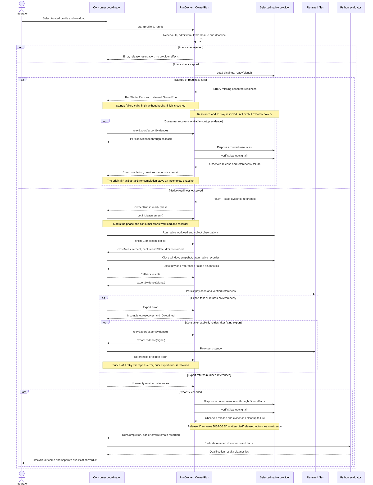

# Architecture

## Repository boundaries

`robotics-runtime` owns contracts, evidence evaluation and the composition host.
`robotics-runtime-infra` owns worker environments, simulator providers, deployment
and qualification. Product repositories supply their own robots, scenes,
controllers, cameras and vision models.

The two Python packages keep independent public versions. A host release and an
infra release have their own identities. A package install, source integration
test and published consumer run establish different claims.

## Composition and native data

### Composition framework

The host uses upstream [Cordis](https://github.com/cordiverse/cordis) `Context`,
`Service`, plugins and `Fiber` lifecycle. Providers register services within
run-owned contexts; the host reuses upstream plugin loading and managed effects.
Pinned versions and the lifecycle API are documented in the [host reference](../host/README.md).
Cluster scheduling belongs to the deployment backend.

Local context and effect management does not qualify simulator behavior,
stable retained payloads or physical cleanup. Those require provider-specific
observation and qualification. Run reservations are process-local; this lifecycle
does not provide crash or distributed recovery.

### Native data

Application services connect bounded jobs to the existing contracts/harness APIs.
They do not implement another document validator, wire protocol or simulator SDK.

Native data stays in its native path:

- control clients use the selected SDK, such as MAVSDK/gRPC;
- camera consumers use the declared media endpoint, such as RTSP/GStreamer;
- simulator workers use their engine's controller, stepping and sensor APIs;
- evaluators consume retained files and exact references.

ROS is a selected integration profile, not a requirement of the common host or
document model. The observer remains attach-only; changing a simulation is a
provider/controller responsibility.

## External API compatibility

The optional [external Test API](external-test-api.md) is a source service for
a limited MIT SignalFlag SDK
[`sdk-v1.8.0`](https://github.com/resim-ai/open-core/tree/sdk-v1.8.0/signalflag/sdk)
recipe. An unmodified installed client uses a configured endpoint, a real JWT,
an existing project and branch, and explicit `metrics_config_path=None` and
`templates_path=None`.

The supported journey creates a light batch and test, emits single-point,
series and event JSONL, uploads files, and closes both contexts. Six REST
operations and actual presigned PUTs are exercised together. Current source CI
covers two tenants, JSONL/PNG/empty uploads, lost registration/close responses,
eight concurrent closes, and recovery of a missing PUT across an API restart.
Exact-version payloads, signatures, public receipts and preserved checkpoints
are verified independently.

The service uses Fastify, jose JWT verification, PostgreSQL tenant/project RLS,
and versioned S3 storage. Existing public core Jobs run bounded public custody
CLIs; they download and verify the original bytes, sign statements and produce
receipts. Per-upload proof checkpoints are committed before the final close.
Producer-reported `SUCCEEDED` or `ERROR` remains external metadata. This API
does not create a native RunOwner, schedule a simulator, convert emissions into
native observations or produce a qualification verdict.

Default SDK metrics configuration adds GraphQL synchronization and BFF routing.
Project-name lookup, systems, test suites, metrics sets and SDK Auth0 helpers
are also outside this recipe. Web UI and product MCP remain separate work.
Opaque retention does not imply native time, topic, unit or result semantics.

This is a source integration, separate from the released host and Python
packages. It has no published API image or deployment qualification. The local
S3-compatible fixture establishes the tested protocol behavior, not AWS
qualification. Compatibility does not cover the vendor's closed backend,
full SDK parity, an SLA or a security certification.

Native contracts, evaluation and evidence remain independent. Core installation
and offline evaluation require no external SDK or vendor account. See the
[optional API process view](architecture/generated/ExternalTestAPI.svg) for the
JWT, metadata, storage and custody boundary.

## Agent access

Product MCP is planned as an optional adapter over the same public operations,
using the maintained MCP SDK. Its first scope is reading run status, evaluation
diagnostics, metrics and verified artifact references. The development
home-compute and CodeGraph servers are not product interfaces.

A Web UI is outside the current implementation sequence. This does not remove
the metadata, identity, storage and authorization required by SDK clients.
Execution controls can be exposed through MCP only with the existing admission
and ownership rules; they do not create a second run manager.

## Simulator providers

Each provider declares its source/runtime/assets, supported environment, native
endpoints and qualification scope. The common lifecycle manages acquisition and
release; it does not add common `setPose`, `step` or flight-control RPCs.

- Gazebo ROS profiles use a supported ROS/Gazebo pair and upstream
  [simulation_interfaces](https://github.com/ros-simulation/simulation_interfaces).
  A ROS-free Gazebo/PX4 profile keeps native Gz Transport and MAVSDK.
- Webots uses its native external controller and `Robot/Supervisor` API.
  Controller camera capture does not imply RTSP or a PX4 bridge.
- Isaac uses native application, physics, rendering and camera-streaming APIs.
  Its GPU/runtime requirements and NVIDIA asset licenses remain local to its
  provider. Isaac Sim and Isaac Lab are separate products.

Native SDF, WBT/PROTO and USD scenes retain their own identities and parameters.
URDF import and OpenUSD assets do not provide a portable physics/controller
contract. There is no automatic scene translator or promise of pixel/trajectory
equivalence.

## Readiness and time

Importing a plugin, resolving its services, connecting a transport, connecting a
device and observing an operation are separate checks. Required pending services
and missing runtime facts cannot be replaced with declaration defaults.

Feature discovery describes advertised support. Qualification checks the actual
operation for the pinned version and environment. A simulator's frame update is
not assumed to be one physics step.

Every run records time authority, domain/epoch, units, resolution and observed
advance. Wall deadlines, physics time, render time and capture time remain
distinct. Reset begins a new simulation epoch. Floating-point seconds are not
reported as exact integer nanoseconds.

Coordinate conventions are explicit. ROS profiles follow REP-103/105; native
stage units, world axes and camera axes are retained with their evidence.

## Ownership and retained evidence

One run owns its plugin bindings and acquired workers, subscriptions and
connections. Trusted immutable configuration supplies executable plugins.
Scope isolation is not a security sandbox and disposal cannot reverse physical
actions.

[State and recovery source](architecture/run-state.mmd), and the
[C4 model and deployment view](architecture/README.md).

Export precedes destructive reset/stop. A standard `STOPPED` state may reset
simulation state; it is not synonymous with process disposal. Cleanup is verified
from real process/container/stream outcomes, independently of a resolved plugin
disposer. Failed export retains resources for explicit recovery. A cleanup failure remains
visible even when disposal returns. The consumer invokes the evaluator separately
after receiving the lifecycle report; a lifecycle outcome is not a qualification
verdict.

## Qualification boundaries

The compiled core host has passed release integrity and external installation
checks. Each cross-simulator host/provider composition remains a development
target until its own published consumer gates pass. Existing package and ROS-profile evidence retains
its original scope; new providers are not qualified by an architecture diagram.

Qualification separates physics-only execution, offscreen sensor rendering and
visual review of real frames. Desktop GUI is an additional deployment capability.
A headless camera stream does not qualify a desktop GUI.

An independent consumer selects Webots or Isaac without installing Gazebo or ROS
in the common host/evaluator. Unsupported capabilities, wrong assets, cancellation,
missing facts and foreign-resource isolation are explicit failures.

The initial flight reference is stock PX4/Gazebo. General Webots/Isaac provider
support does not qualify drone dynamics, a vision model, physical actuation,
GPU/NPU inference or HIL.
