# Optional external Test API

This source service supports the limited external Test recipe below with
unmodified SignalFlag SDK 1.8.0. Projects, branches and tenant membership are
configured before the SDK runs. A completed SDK Test reports producer metadata;
it does not qualify a robot or launch a native workload.

## Run the source fixture

From a checkout, with Docker, its default Buildx builder, Git, Bash and Python 3:

~~~bash
API_FIXTURE_ENGINE=docker api/test/run-fixture.sh
~~~

The driver builds the API, unchanged installed SDK and custody inputs from
[pinned sources](../api/test/upstream-lock.json). It creates disposable local
PostgreSQL 18.6, Keycloak 26.8 and SeaweedFS 4.29 services, generates private
fixture credentials, and removes its owned resources. It is a finite test,
not a long-running service deployment. A refused check or
unverified cleanup returns a nonzero exit. Safe reports and original custody
proofs are retained under `artifacts/api-ci-safe/`.

The fixture exercises both tenants, default configuration sync, all six REST
operations, JSONL/PNG/empty PUTs, authorization refusals, lost configuration,
registration and close responses, eight concurrent
closes and two-upload recovery after a refused close and API restart. It verifies
exact VersionId payloads and preserves the first committed proof checkpoint.
SeaweedFS is a local S3-compatible protocol fixture; this is not AWS qualification.

## Use an installed SDK

Obtain a real token from the configured issuer and authorize its subject through
tenant/project membership. The client receives that token explicitly; this
recipe does not use the SDK's Auth0 helpers. Install the client in your own
Python environment with the [pinned dependency lock](../api/test/sdk-requirements.lock).

~~~python
from pathlib import Path

import httpx
from signalflag.sdk.batch import Batch
from signalflag.sdk.client import AuthenticatedClient
from signalflag.sdk.test import LogType, Test

token = Path("/run/secrets/sdk-token").read_text().strip()
client = AuthenticatedClient(
    base_url="http://api:3000",
    token=token,
    timeout=httpx.Timeout(90.0),
)

config = Path(".resim/metrics/config.resim.yml")
config.parent.mkdir(parents=True, exist_ok=True)
config.write_text("version: 1\ntopics:\n  motion:\n    schema:\n      speed: float\n")
Path("empty.log").write_bytes(b"")
with Batch(
    client=client,
    project_id="YOUR_EXISTING_PROJECT_UUID",
    branch="main",
    name="External Test",
) as batch:
    with Test(client=client, batch=batch, name="opaque external test") as run:
        run.emit("motion", {"speed": 1}, timestamp=1_791_000_000_000_000_000)
        run.attach_log("attachment.png", log_type=LogType.OTHER_LOG, wait=True)
        run.attach_log("empty.log", log_type=LogType.OTHER_LOG, wait=True)
~~~

The example uses the fixture's container-network API address. Replace the
endpoint and project UUID with configured values, and supply the PNG file.
Both the API and returned S3 upload URL must be reachable from the client.
The Test context flushes and uploads the SDK's original emissions JSONL.
The default config path synchronizes this file before the REST journey.
Optional immediate `.liquid` files under `.resim/metrics/templates` are stored
as bytes; a missing template directory sends an empty list. Passing
`metrics_config_path=None` still supports the recipe without configuration sync.
Do not add `project_name`, system, test-suite or metrics-set options.

The service implements this bounded surface:

~~~text
POST /graphql  (UpdateMetricsConfig only)
GET  /projects/{projectID}/branches?name=main
POST /projects/{projectID}/batches/light
POST /projects/{projectID}/batches/{batchID}/jobs
POST /projects/{projectID}/batches/{batchID}/jobs/{jobID}/logs
POST /projects/{projectID}/batches/{batchID}/jobs/{jobID}/close
POST /projects/{projectID}/batches/{batchID}/close
~~~

Log registration returns the fixed server-owned object URL and required PUT
headers. Checksum, size, media type and exact VersionId must match before custody.
An identical pending, unbound registration can renew its URL after a refused
close. A close retry must preserve the original producer claim. Registration
identity and close recovery do not deduplicate batch/job creation for the
unchanged SDK: it supplies no per-creation key. Own clients can use the optional
header below.

## Retry batch and job creation

Own clients may send `Idempotency-Key: "CLIENT_GENERATED_UUID"` with either
creation POST. Use a new key for each intended batch or job and preserve it
across retries, including a lost HTTP response. The value is one quoted ASCII
Structured Fields string of 1–256 characters, without parameters; malformed
headers return 400 before creation. Parsing uses
[structured-headers](https://github.com/evert/structured-headers). The header
name follows the [HTTPAPI draft](https://datatracker.ietf.org/doc/draft-ietf-httpapi-idempotency-key-header/),
not a published RFC; the behavior below is this service's contract.

A committed identical request returns the original 201 creation response.
The batch key is scoped to tenant, project and authenticated principal; the
job key also includes its batch. Reusing a key with different creation fields
returns 409. Batch fingerprints include branch, optional name and version;
an omitted `metricsSetName` and `null` have the same meaning. JSON member order
does not change identity. A retry preserves the first batch's configuration
snapshot even after the branch changes.

Concurrent requests settle through PostgreSQL transactions and unique indexes.
A matching request waits for the competing transaction and returns its
committed creation. If the bounded lock wait fails, retry the same key.
Failed or rolled-back transactions do not claim a key. Keys are retained for
the lifetime of their rows; there is no time-based expiry. A service/database
restart preserves them. Authorization is checked again on every request.

The response describes the original creation, including after the batch or
job closes. It is not a current-state query or a native verdict. Requests
without a key retain the existing behavior and can create duplicates. The
unchanged SDK does not add keys automatically.

## Configuration snapshots

`UpdateMetricsConfig` accepts `projectId: String!`, `config: String!`,
`templateFiles: [MetricsTemplate!]!` and `branch: String`. Each template contains
`name` and base64 `contents`. This recipe requires an existing project and branch.
Successful acknowledgement follows the SQL commit; GraphQL errors remain errors
to the SDK. Multiple fields use standard GraphQL serial mutation semantics:
a refused later field does not roll back an earlier committed field.

Canonical base64 is bounded before decoding: configuration up to 256 KiB,
at most 32 templates of up to 64 KiB each, and 512 KiB combined decoded bytes.
Template names are unique basenames. A single configuration file preserves its
original bytes; multiple paths upload the YAML merged by the unchanged SDK.
The server stores configuration and template bytes without executing Liquid
or evaluating metrics. The SDK may validate emissions locally.

A batch pins the current branch snapshot atomically. Later updates preserve
that batch's original snapshot. The SDK passes no snapshot identity between
sync and batch creation, so concurrent callers cannot assume a batch uses their
own last uploaded configuration. Repeating identical config bytes on the same
branch reuses the snapshot; `sync_config` itself does not retry a lost response.
The fixture's retry is an explicit new call by the caller.

The SDK derives `/graphql` by replacing the first `api.` in the hostname with
`bff.` and dropping the base path. The example's `http://api:3000` stays on the
same host. A deployment using `api.example` must route the derived
`bff.example` hostname to this same optional service.

## Service boundary

The [entry point](../api/src/main.ts) configures a separate Fastify process.
The [base migration](../api/sql/001-external-tests.sql) and
[configuration migration](../api/sql/002-metrics-config.sql) use forced tenant/project
RLS. Apply the [creation-key migration](../api/sql/003-creation-idempotency.sql)
before running this service; the application role must not own tables or reach privileged roles.
JWT verification fixes issuer, audience, RS256, subject, expiry and the
`sdk-write` role. Each SQL transaction sets the verified issuer/subject on the
same client.

Storage endpoints, bucket, object keys, byte limits, credential files, signing
policy and worker commands belong to the server. The SDK cannot select an
arbitrary URI or worker argv. Public core Jobs settle finite CLI processes;
existing custody validators remain authoritative. Original proof blobs are
committed per upload, and the job closes only when every upload is retained.

This optional package is private and has no published API image release.
Released Python packages and host artifacts do not install the service.
Only the configuration mutation is supplied through GraphQL; metrics evaluation,
other vendor GraphQL operations, SDK Auth0 helpers, Web UI and product MCP are
not supplied. Producer status is not a native verdict, opaque emissions are
not converted into native observations, and the service does not use RunOwner.
The source fixture does not establish deployment, AWS, full vendor-platform
compatibility or an SLA.
