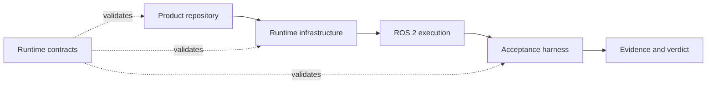

# Robotics Runtime Contracts

[](https://github.com/mmkolpakov/robotics-runtime-contracts/actions/workflows/ci.yml)
[](LICENSE)

Canonical, machine-verifiable contracts for portable robotics executions.

This package defines the boundary shared by product repositories, runtime
infrastructure, and acceptance tooling. It validates requested scenarios,
observed runtimes, evidence, qualification inputs, and verdicts. It does not
launch ROS 2, choose a simulator, collect telemetry, or contain product logic.

## Architecture



The contracts are independent of a particular robot or product. They describe
ROS 2 execution, security and timing concepts, including implementation-specific
constraints. Provider identities are recorded as data or namespaced extensions;
they do not select a schema.

## Install

Python 3.12 through 3.14 is supported. Install a wheel from a tagged
[GitHub Release](https://github.com/mmkolpakov/robotics-runtime-contracts/releases),
or create a development environment:

```bash
uv sync --locked --all-groups
```

Release assets include build-provenance attestations. See
[SUPPLY_CHAIN.md](SUPPLY_CHAIN.md).

## CLI

Validate JSON or YAML using its declared `schema_version`:

```bash
robotics-contracts validate scenario.yaml
```

Resolve reviewed RFC 7396 overlays and retain their origin trace:

```bash
robotics-contracts scenario resolve base.yaml \
  --overlay camera.yaml \
  --overlay limits.yaml \
  --output resolved.yaml \
  --trace-output resolution-trace.json
```

Validate a complete, digest-linked qualification set:

```bash
robotics-contracts validate-qualification \
  --artifact scenario:scenario.json=scenario.json \
  --artifact acceptance_run:acceptance-run.json=run.json \
  --artifact runtime_manifest:runtime-manifests/main.json=runtime.json \
  --artifact domain_result:results/main.json=result.json \
  --artifact acceptance_aggregate:acceptance-aggregate.json=aggregate.json
```

Use `--quiet` for gates and `--format json` for stable machine-readable
diagnostics. `describe` reports a schema identifier and digest, `diff` emits an
RFC 7396 merge patch, and `permit init --subject-digest ...` creates an unsigned
physical-execution permit for an external signing workflow.

## Python API

```python
from robotics_runtime_contracts import (
    schema_for_role,
    schema_registry,
    validate_document,
    validate_role,
)

validate_document(document)
validate_role(document, "acceptance_scenario")
print(schema_for_role("runtime_manifest"))
registry = schema_registry()
```

Validation is offline, does not mutate inputs, and rejects non-finite numbers.
It reports the first failure; structural and semantic document errors normally
include a JSON path, while qualification-link and some input errors do not.
The package exports `worst_status()` for consumers to share status-folding
rules; this does not mean every consumer already uses it.

## Contract Set

Release 0.16 publishes one catalogued `v1` contract set. These identifiers are
not compatible with every historical `v1` document. The
machine-readable source of truth is
[`catalog.v1.json`](src/robotics_runtime_contracts/schemas/catalog.v1.json).

| Area | Public roles |
| --- | --- |
| Execution | scenario, run, observation, result, aggregate, campaign |
| Runtime | runtime manifest, model manifest, dataset manifest |
| Evidence | evidence index, recording summary, artifact receipt |
| Qualification | profile, conformance result, bundle, policy |
| Physical safety | execution permit and verification |
| Cross-domain transport | channel, observation, clock relation, causal chain, qualification result |

Every public document uses JSON Schema Draft 2020-12, declares a
`schema_version` ending in `.v1`, rejects unknown root fields, and has an ID in
the `urn:robotics-runtime-contracts:v1:*` namespace. Internal schema resources
exist only to remove duplication and are not document roles.

## Extensions

Scenario extensions can use digest-pinned schemas without changing the common
contract. This validation currently applies only to acceptance scenarios;
`extensions` in other document roles do not receive the same schema checks.
Extension schemas are interpreted as Draft 2020-12. Extension keys use
reverse-domain namespaces such as
`org.example.sorting`; schema bytes are supplied by the caller and are never
fetched from the network.

```python
validate_document(
    scenario,
    extension_schemas={
        "https://schemas.example.org/sorting.v1.schema.json": schema_bytes,
    },
)
```

Promote an extension into the common catalog only after it has reusable
semantics and evidence from more than one domain.

## Merge patches and semantic diff

Scenario overlays use the native, typed implementation of
[RFC 7396 section 2](https://www.rfc-editor.org/rfc/rfc7396#section-2).
Object members merge recursively, `null` removes a member, and arrays replace
as a whole. Inputs and outputs do not share mutable containers. Overlays apply
in the given order, followed by contract validation.

`semantic_diff` compares parsed values recursively without Python's scalar
coercions: booleans differ from numbers, and integer/float representations such
as `1` and `1.0` also produce a patch. Object key order and source formatting are
ignored. A round-trip check rejects targets that require introducing an object
member with value `null`, using `diff.unrepresentable`; an unchanged existing
`null` and nulls inside replaced arrays are representable. This distinction is
part of the diff API; RFC 7396 specifies patch application, not diff generation.
The implementation is checked against the RFC's 15 Appendix A vectors and
generated round-trip cases. It has no third-party merge-patch dependency.

## JSON and YAML input

Documents are UTF-8 mappings with string keys and finite JSON values. Files
ending in `.json` are parsed strictly as JSON, without a YAML fallback;
`.yaml`/`.yml` select YAML. For unnamed input, standard input, and other suffixes,
a leading `{` or `[` selects strict JSON and other input selects YAML. Pass a
YAML `source_name` to `loads_mapping` when using YAML flow syntax such as
`{key: value}`. Duplicate keys are rejected in both formats, including nested
objects and escaped spellings of the same JSON key. Digest-pinned extension
schemas use the same strict JSON parser.

The YAML loader uses the [YAML 1.2 core scalar rules](https://yaml.org/spec/1.2.2/#1032-tag-resolution):
dates and timestamps stay strings; `yes`, `no`, `on`, `off`, `1:30`, `0b10` and
`1_000` stay strings; only the core `true`/`false` spellings become booleans.
`010` is decimal 10; `0o10` is octal 8 and `0x10` is hexadecimal 16. `1.10` and
`1e2` are numbers; quote them when they represent textual versions or IDs.
Non-finite numbers, non-string keys, non-core tags, aliases (including recursive
and merge aliases), and multiple YAML documents are rejected. `<<` has no merge
semantics. YAML output quotes strings using the same scalar rules and emits no
aliases, so reading a written document preserves its JSON values.

Each contract document or extension schema is limited to 8 MiB of UTF-8 input,
64 node levels (root at level 1), and 100,000 nodes, counting mapping keys and
values. File and stdin reads stop at the byte limit plus one sentinel byte.
These bounds apply to document loaders, not retained raw evidence files.
Limit failures use `input.limit_exceeded`, duplicates use `input.duplicate_key`
with the member path, and aliases use `input.yaml_alias`. Other malformed input
uses `input.parse_failed`; non-finite values use `input.non_finite_number`.

## Deterministic JSON and artifact hashes

`dumps_canonical(document) -> bytes` implements this project's deterministic
JSON profile. **It is not RFC 8785/JCS.** Existing contract integers, including
nanoseconds beyond 2**53, remain exact JSON number tokens. No schemas or wire
types change to satisfy JCS's binary64 domain. This is an explicit compatibility
choice, not a fallback from a strict JCS implementation.

The profile accepts built-in `dict`, `list`, `str`, `int`, `float`, `bool` and
`None` values. Object keys must be strings. It emits UTF-8 without a BOM or
trailing newline, with compact `,`/`:` separators. Object keys sort recursively
by Unicode code point, which differs from JCS's UTF-16 ordering; array order
is preserved. Unicode is not normalized, non-ASCII characters remain UTF-8,
and JSON control/quote/backslash escaping uses the native Python JSON encoder.
Surrogate code points in Python strings are rejected. A valid JSON surrogate
escape pair parsed into a Unicode scalar is supported.

Integers have no 53-bit or 64-bit cap and are never converted to float or string
values. Booleans stay distinct from integers. Finite floats use native Python
JSON spelling: `1.0`, `1e-06`, and `-0.0` remain those spellings, including the
negative-zero sign. This preserves the supplied float; it cannot recover
decimal precision already lost before the call. Tuples, sets, bytes, Decimal,
custom objects and subclasses of the accepted built-ins are not coerced.

The input tree uses the same 64-level and 100,000-node limits as the loaders,
counting keys and values with the root at level 1. Encoded output is limited to
8 MiB, including escaping and UTF-8 expansion. Individual oversized strings
and integers are rejected before assembling output. The interpreter's integer
decimal-conversion limit also applies and is never changed process-wide.
Shared containers are expanded within the node budget; cycles fail the depth
limit. Errors inherit `ContractError`: `input.invalid_type`,
`input.invalid_unicode`, `input.non_finite_number`, or `input.limit_exceeded`.
Paths identify the invalid value, the object containing a non-string or oversized
key, or `$` for the total output-byte limit. Diagnostic paths also have an 8 MiB
UTF-8 budget: when a member or index would exceed it, errors in that subtree use
the nearest enclosing path that fits. Key sizes are checked before constructing
their paths, and diagnostic escaping uses bounded chunks. This does not narrow
the accepted keys or change serialized bytes. Serialization does not mutate the
input.

```python
from robotics_runtime_contracts import dumps_canonical, file_sha256

encoded = dumps_canonical({"ns": 1785067200123456789, "ready": True})
assert encoded == b'{"ns":1785067200123456789,"ready":true}'
digest = file_sha256("existing-evidence.bin")
```

`file_sha256(path) -> str` returns the lowercase SHA-256 hex digest of the
**original file bytes**, read in 1 MiB chunks. It expands home paths, propagates
normal file I/O errors and does not apply the document-size limit to artifacts.
It never parses or serializes the file, even for JSON, and works on binary data.
There is no `document_digest` API. Existing receipts and signatures continue
to refer to original bytes. Re-serializing a separate copy can change its hash;
replacing an existing artifact requires rebuilding its dependent hash/signature
chain. Hash new files only after their exact bytes have been written.

## Errors and resource paths

Expected validation and document-operation failures inherit from the public
`ContractError`, which remains a `ValueError`. Existing specialized exception
classes and their constructor signatures remain available. Every contract
error has an `error_id` and a `json_path` (`None` when no document location
applies). The CLI keeps its JSON diagnostic envelope
`{"error": {"error_id": "...", "message": "...", "path": "..."}}`; `path` is
omitted when unavailable. Schema diagnostics use jsonschema's `best_match`,
including nested `anyOf`/`oneOf` errors, so the chosen message can change. See
[jsonschema's selection rules](https://python-jsonschema.readthedocs.io/en/stable/errors/#best-match-and-relevance).

CLI exit codes are 0 for success, 1 for invalid input, I/O failures or internal
errors, and 2 for invalid arguments (including conflicting paths and malformed
artifact/extension options). I/O errors use `input.io_error`; unexpected
exceptions use `internal.error` without a traceback. Python I/O APIs retain
their normal `OSError` behavior. Library programming errors are not converted
to validation failures. `--help` and process interrupts retain normal behavior.
All CLI file inputs and outputs expand `~` before accessing the filesystem.

Error families include `schema.validation_failed`, `schema.unknown`,
`schema.role_unknown`, `schema.reference_invalid`, `semantic.validation_failed`,
`extension.validation_failed`, `qualification.invalid`,
`qualification.unknown_domain`, `qualification.unknown_channel`,
`provider.requirements_unsatisfied`, `receipt.validation_failed`,
`clock.evidence_invalid`, `status.invalid`, `input.parse_failed`,
`input.non_finite_number`, `input.invalid_timestamp`, `input.invalid`,
and `cli.arguments_invalid`. Extension references resolve offline; dangling or
non-terminating references encountered during validation are extension errors.
Timestamp comparisons share one offset-aware parser; timestamp format
validation remains the responsibility of the contract schema.

`schema_dir()` and `schema_path()` still return `pathlib.Path` objects. For
zip imports, `importlib.resources.as_file` extracts the schema directory once
and its context stays open until process exit; an `atexit` handler removes the
temporary directory, following the
[resource context lifetime](https://docs.python.org/3/library/importlib.resources.html#importlib.resources.as_file).
Callers can retain these paths within the process without
adopting a context-manager API. Paths must not be persisted for another process.

## Version Policy

Known consumers include the acceptance harness and runtime infra. They use
different contract generations; see the dated consumer table in
[COMPATIBILITY.md](COMPATIBILITY.md) and the
[0.15 to 0.16 migration guide](docs/migrations/0.15-to-0.16.md).
Published schema names now permit only additive changes; breaking changes
require a new schema major and migration notes. The structural compatibility
gate is planned, so published schema changes remain deferred. Released tags
and artifacts remain immutable. See [CHANGELOG.md](CHANGELOG.md).

HIL and real-target contracts are observation-only. A valid document is not an
authorization to actuate hardware and is not proof that a device or accelerator
has been qualified.

## Development

```bash
uv sync --locked --all-groups
uv run pre-commit run --all-files --show-diff-on-failure
uv run pytest
uv build --no-sources
```

Consumer examples live in [`consumer-examples/`](consumer-examples/).
Contributions must follow [CONTRIBUTING.md](CONTRIBUTING.md), and security
reports must follow [SECURITY.md](SECURITY.md).

## License

[MIT](LICENSE)
